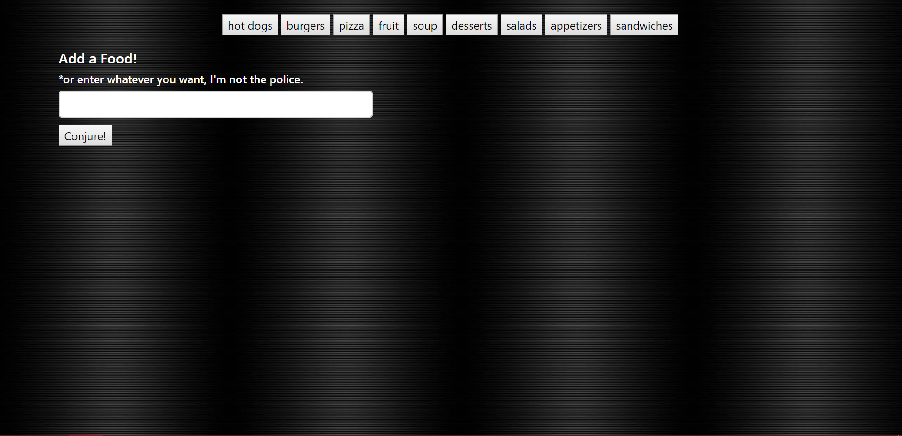
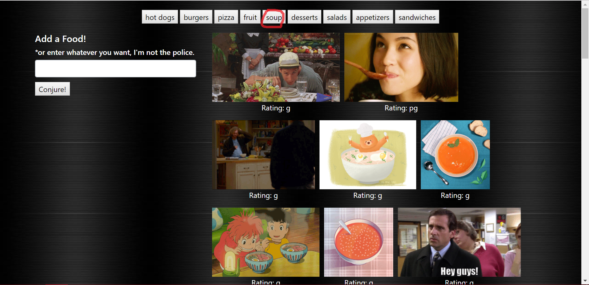
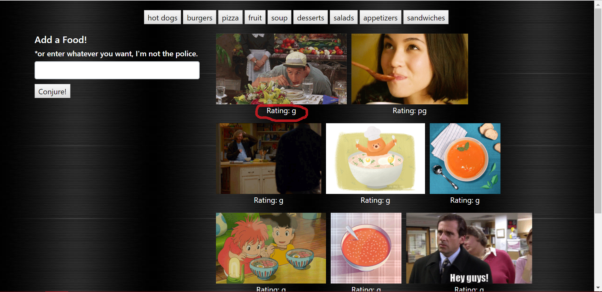
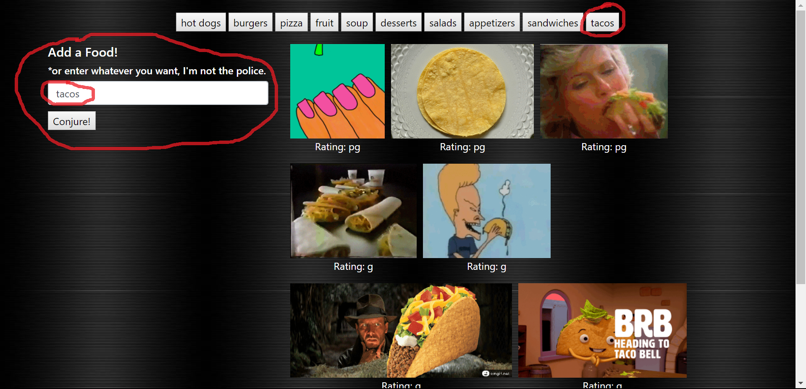

# giftastic

Giftastic is an app that uses the GIPHY API to make a dynamic web page that populates with gifs of the user's choice. 

The app takes topics that are in an initial array (food themed) and creates buttons in the HTML.

When the user clicks on a button, 10 static, non-animated gif images are grabbed from the GIPHY API and placed on the page.

When the user clicks one of the still GIPHY images, the gif will animate. If the user clicks the gif again, it will stop playing.

Under every gif, the rating is displayed (akin to movie ratings)

There is also a form on the page that takes the value from user's input box and adds it into the topics array which inturn adds a new button with the new topic to the page. The input doesn't need to match the food theme, it can be whatever.

Try out the app [HERE](https://bdelong.github.io/giftastic/)!